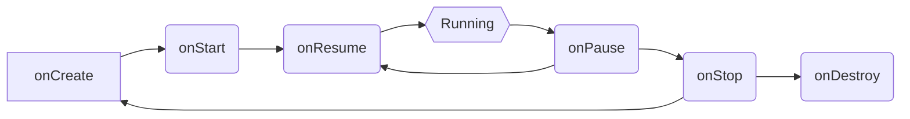

# Java Exam Questions (Units 3-5)

## Unit 3: Multithreading and File I/O

### Multithreading

**1. Explain the difference between a process and a thread with examples.**

*   **Process:** A process is an independent execution environment with its own memory space. It's a heavyweight entity. Examples include running a web browser or a text editor.
*   **Thread:** A thread is a lightweight sub-process that shares the same memory space as other threads within the same process. Examples include downloading a file in a web browser (one thread) while you continue browsing (another thread).

**2. Describe the thread lifecycle in Java and the significance of each state.**

The thread lifecycle in Java consists of the following states:

*   **New:** A thread is in the new state when a new `Thread` object is created but `start()` hasn't been called.
*   **Runnable:** After calling `start()`, the thread enters the runnable state. It's ready to be executed by the JVM.
*   **Running:** The thread is currently executing.
*   **Blocked/Waiting:** A thread enters this state when it's waiting for a monitor lock or another thread to complete a task (e.g., `wait()`, `join()`).
*   **Timed Waiting:** Similar to waiting, but the thread waits for a specified amount of time (e.g., `sleep()`, `wait(timeout)`).
*   **Terminated:** The thread has completed its execution or has been terminated due to an exception.

**3. Write code to create and start a new thread by extending the Thread class.**

```java
class MyThread extends Thread {
    @Override
    public void run() {
        System.out.println("Thread running");
    }
}

public class Main {
    public static void main(String[] args) {
        MyThread thread = new MyThread();
        thread.start();
    }
}
```

**4. Write code to create and start a new thread by implementing the Runnable interface. Compare this approach with extending Thread.**

```java
class MyRunnable implements Runnable {
    @Override
    public void run() {
        System.out.println("Thread running");
    }
}

public class Main {
    public static void main(String[] args) {
        Thread thread = new Thread(MyRunnable());
        thread.start();
    }
}
```

*   **Comparison:** Implementing `Runnable` is preferred because it allows a class to extend another class while still being able to run in a thread. Extending `Thread` prevents a class from extending any other class.

**5. What are race conditions? Provide an example and explain how to prevent them in Java.**

*   **Race Condition:** A race condition occurs when multiple threads access and modify shared data concurrently, leading to unpredictable results.

```java
class Counter {
    private int count = 0;

    public void increment() {
        count++; // Race condition
    }

    public int getCount() {
        return count;
    }
}
```

*   **Prevention:** Use synchronization to protect shared resources.

```java
class Counter {
    private int count = 0;

    public synchronized void increment() {
        count++;
    }

    public int getCount() {
        return count;
    }
}
```

**6. Explain the purpose and usage of the synchronized keyword in Java multithreading.**

*   **Purpose:** The `synchronized` keyword provides a lock on an object or method, ensuring that only one thread can access it at a time.
*   **Usage:** It can be used with methods or blocks of code.

```java
public synchronized void myMethod() {
    // Code that needs synchronization
}

synchronized (object) {
    // Code that needs synchronization
}
```

**7. How would you implement inter-thread communication in Java? Explain with code examples.**

*   **Inter-thread communication:** Achieved using `wait()`, `notify()`, and `notifyAll()` methods.

```java
class Data {
    private String packet;
    private boolean transfer = true;

    public synchronized void send(String packet) {
        while (!transfer) {
            try {
                wait();
            } catch (InterruptedException e)  {
                Thread.currentThread().interrupt();
                System.err.println("Thread interrupted: " + e.getMessage());
            }
        }
        transfer = false;
        this.packet = packet;
        notifyAll();
    }

    public synchronized String receive() {
        while (transfer) {
            try {
                wait();
            } catch (InterruptedException e)  {
                Thread.currentThread().interrupt();
                System.err.println("Thread interrupted: " + e.getMessage());
            }
        }
        transfer = true;

        notifyAll();
        return packet;
    }
}
```

**8. What is thread pooling? Explain how ExecutorService helps in managing thread pools.**

*   **Thread Pooling:** A thread pool is a collection of pre-initialized threads that are ready to execute tasks.
*   **ExecutorService:** `ExecutorService` provides methods to manage thread pools, submit tasks, and control concurrency.

```java
ExecutorService executor = Executors.newFixedThreadPool(5);
executor.submit(new MyRunnable());
executor.shutdown();
```

### File I/O

**1. Differentiate between byte streams and character streams in Java I/O.**

*   **Byte Streams:** Operate on raw bytes (8-bit). Used for binary files (e.g., images, audio). Classes include `InputStream` and `OutputStream`.
*   **Character Streams:** Operate on characters (16-bit Unicode). Used for text files. Classes include `Reader` and `Writer`.

**2. Write code to read from a text file using character streams.**

```java
import java.io.BufferedReader;
import java.io.FileReader;
import java.io.IOException;

public class Main {
    public static void main(String[] args) {
        try (BufferedReader br = new BufferedReader(new FileReader("mytext.txt"))) {
            String line;
            while ((line = br.readLine()) != null) {
                System.out.println(line);
            }
        } catch (IOException e) {
            System.err.println("IOException: " + e.getMessage());
        }
    }
}
```

**3. Write code to write to a binary file using byte streams.**

```java
import java.io.FileOutputStream;
import java.io.IOException;

public class Main {
    public static void main(String[] args) {
        try (FileOutputStream fos = new FileOutputStream("mybinary.dat")) {
            byte[] data = {65, 66, 67}; // Example data
            fos.write(data);
        } catch (IOException e) {
            System.err.println("IOException: " + e.getMessage());
        }
    }
}
```

**4. Implement a method that copies the contents of one file to another.**

```java
import java.io.FileInputStream;
import java.io.FileOutputStream;
import java.io.IOException;

public class Main {
    public static void copyFile(String source, String destination) throws IOException {
        try (FileInputStream fis = new FileInputStream(source);
             FileOutputStream fos = new FileOutputStream(destination)) {
            byte[] buffer = new byte[1024];
            int length;
            while ((length = fis.read(buffer)) > 0) {
                fos.write(buffer, 0, length);
            }
        }
    }

    public static void main(String[] args) {
        try {
            copyFile("source.txt", "destination.txt");
        } catch (IOException e) {
            System.err.println("IOException: " + e.getMessage());
        }
    }
}
```

**5. Explain the advantages of using BufferedReader/BufferedWriter over FileReader/FileWriter.**

*   **BufferedReader/BufferedWriter:** Provide buffering, which improves performance by reducing the number of I/O operations.

**6. What is the purpose of the try-with-resources statement when working with I/O operations?**

*   **try-with-resources:** Ensures that resources (e.g., streams) are closed automatically after use, preventing resource leaks.

**7. Write code to create a directory structure and a file within it programmatically.**

```java
import java.io.File;
import java.io.IOException;

public class Main {
    public static void main(String[] args) {
        File dir = new File("mydir");
        if (dir.mkdir()) {
            File file = new File(dir, "myfile.txt");
            try {
                if (file.createNewFile()) {
                    System.out.println("File created");
                } else {
                    System.out.println("File already exists");
                }
            } catch (IOException e) {
                System.err.println("IOException: " + e.getMessage());
            }
        } else {
            System.out.println("Directory already exists");
        }
    }
}
```

### Collection Classes

**1. Compare ArrayList and LinkedList in terms of their performance for different operations.**

*   **ArrayList:** Fast for random access (get/set), slow for insertions/deletions in the middle.
*   **LinkedList:** Slow for random access, fast for insertions/deletions in the middle.

**2. When would you choose Vector over ArrayList? Discuss the trade-offs.**

*   **Vector:** Thread-safe (synchronized), but slower.
*   **ArrayList:** Not thread-safe, but faster.
*   **Choice:** Use `Vector` in multithreaded environments where thread safety is crucial. Otherwise, `ArrayList` is generally preferred.

**3. Explain the differences between HashSet, LinkedHashSet, and TreeSet.**

*   **HashSet:** Unordered, uses hashing for fast access.
*   **LinkedHashSet:** Ordered (insertion order), maintains a linked list of elements.
*   **TreeSet:** Sorted (natural order or custom comparator), uses a tree structure.

**4. Write code to iterate through a collection using various approaches (for loop, enhanced for loop, Iterator, forEach).**

```java
import java.util.ArrayList;
import java.util.Iterator;
import java.util.List;

public class Main {
    public static void main(String[] args) {
        List<String> list = new ArrayList<>();
        list.add("A");
        list.add("B");
        list.add("C");

        // For loop
        for (int i = 0; i < list.size(); i++) {
            System.out.println(list.get(i));
        }

        // Enhanced for loop
        for (String s : list) {
            System.out.println(s);
        }

        // Iterator
        Iterator<String> iterator = list.iterator();
        while (iterator.hasNext()) {
            System.out.println(iterator.next());
        }

        // ForEach
        list.forEach(System.out::println);
    }
}
```

**5. Describe a scenario where you would choose HashMap over TreeMap and vice versa.**

*   **HashMap:** Use when you need fast access and order doesn't matter.
*   **TreeMap:** Use when you need sorted keys.

**6. Implement a method that removes duplicates from a list using appropriate collection classes.**

```java
import java.util.ArrayList;
import java.util.HashSet;
import java.util.List;
import java.util.Set;

public class Main {
    public static <T> List<T> removeDuplicates(List<T> list) {
        Set<T> set = new HashSet<>(list);
        return new ArrayList<>(set);
    }

    public static void main(String[] args) {
        List<Integer> list = new ArrayList<>();
        list.add(1);
        list.add(2);
        list.add(1);
        list.add(3);

        List<Integer> uniqueList = removeDuplicates(list);
        System.out.println(uniqueList); // Output: [1, 2, 3]
    }
}
```

## Unit 4: Event Handling and JDBC

### Event Handling

**1. What is the delegation event model in Java? Explain its components.**

*   **Delegation Event Model:** A design pattern where the source of an event delegates the handling of the event to a separate listener object.
*   **Components:**
    *   **Event Source:** The object that generates the event.
    *   **Event Object:** An object that encapsulates information about the event.
    *   **Event Listener:** An object that listens for specific events and handles them.

**2. Explain the concept of event classes and event listener interfaces in Java.**

*   **Event Classes:** Represent specific events (e.g., `ActionEvent`, `MouseEvent`).
*   **Event Listener Interfaces:** Define methods that must be implemented to handle specific events (e.g., `ActionListener`, `MouseListener`).

**3. Write code to implement an ActionListener to handle button clicks in a GUI application.**

```java
import java.awt.event.ActionEvent;
import java.awt.event.ActionListener;
import javax.swing.JButton;
import javax.swing.JFrame;
import javax.swing.JOptionPane;

public class Main {
    public static void main(String[] args) {
        JFrame frame = new JFrame("Button Example");
        JButton button = new JButton("Click Me");

        button.addActionListener(new ActionListener() {
            @Override
            public void actionPerformed(ActionEvent e) {
                JOptionPane.showMessageDialog(frame, "Button Clicked!");
            }
        });

        frame.add(button);
        frame.setSize(300, 200);
        frame.setDefaultCloseOperation(JFrame.EXIT_ON_CLOSE);
        frame.setVisible(true);
    }
}
```

**4. How would you handle multiple events with a single listener?**

*   Implement multiple listener interfaces in the same class and use conditional statements to handle different events.

**5. Compare event adapters and event listeners. When would you use each?**

*   **Event Listeners:** Interfaces that require implementing all methods.
*   **Event Adapters:** Classes that provide default implementations for all methods in a listener interface.
*   **Use:** Use adapters when you only need to handle a subset of events, avoiding the need to implement all methods.

**6. Describe the event propagation mechanism in AWT/Swing.**

*   **Event Propagation:** The process by which events are passed through the component hierarchy. It typically involves two phases:
    *   **Event Capturing:** The event travels down the component hierarchy from the root to the source.
    *   **Event Bubbling:** The event travels back up the component hierarchy from the source to the root.

### JDBC

**1. Explain the structure and architecture of JDBC.**

*   **JDBC (Java Database Connectivity):** An API that allows Java applications to interact with databases.
*   **Architecture:**
    *   **JDBC API:** Provides interfaces and classes for database access.
    *   **JDBC Driver Manager:** Manages JDBC drivers.
    *   **JDBC Driver:** A database-specific driver that implements the JDBC interfaces.

**2. Write code to establish a connection to a MySQL database using JDBC.**

```java
import java.sql.Connection;
import java.sql.DriverManager;
import java.sql.SQLException;

public class Main {
    public static void main(String[] args) {
        String url = "jdbc:mysql://localhost:3306/mydatabase";
        String user = "myuser";
        String password = "mypassword";

        try {
            Connection connection = DriverManager.getConnection(url, user, password);
            System.out.println("Connected to database");
            connection.close();
        } catch (SQLException e) {
            System.err.println("SQLException: " + e.getMessage());
        }
    }
}
```

**3. Implement a method to execute a SQL query and process the ResultSet.**

```java
import java.sql.Connection;
import java.sql.DriverManager;
import java.sql.ResultSet;
import java.sql.SQLException;
import java.sql.Statement;

public class Main {
    public static void main(String[] args) {
        String url = "jdbc:mysql://localhost:3306/mydatabase";
        String user = "myuser";
        String password = "mypassword";

        try (Connection connection = DriverManager.getConnection(url, user, password);
             Statement statement = connection.createStatement();
             ResultSet resultSet = statement.executeQuery("SELECT * FROM mytable")) {

            while (resultSet.next()) {
                System.out.println(resultSet.getString("column1") + " " + resultSet.getInt("column2"));
            }

        } catch (SQLException e) {
            System.err.println("SQLException: " + e.getMessage());
        }
    }
}
```

**4. How would you perform a transaction using JDBC? Write code to demonstrate.**

```java
import java.sql.Connection;
import java.sql.DriverManager;
import java.sql.SQLException;
import java.sql.Statement;

public class Main {
    public static void main(String[] args) {
        String url = "jdbc:mysql://localhost:3306/mydatabase";
        String user = "myuser";
        String password = "mypassword";

        try (Connection connection = DriverManager.getConnection(url, user, password)) {
            connection.setAutoCommit(false);

            try (Statement statement = connection.createStatement()) {
                statement.executeUpdate("UPDATE mytable SET column2 = 10 WHERE column1 = 'A'");
                statement.executeUpdate("UPDATE mytable SET column2 = 20 WHERE column1 = 'B'");

                connection.commit();
                System.out.println("Transaction committed");

            } catch (SQLException e) {
                connection.rollback();
                System.err.println("Transaction rolled back. SQLException: " + e.getMessage());
            }

        } catch (SQLException e) {
            System.err.println("SQLException: " + e.getMessage());
        }
    }
}
```

**5. What are prepared statements? Write code showing how to use them and explain their advantages.**

*   **Prepared Statements:** Precompiled SQL statements that can be executed multiple times with different parameters.
*   **Advantages:**
    *   **Performance:** Faster execution for repeated queries.
    *   **Security:** Prevents SQL injection attacks.

```java
import java.sql.Connection;
import java.sql.DriverManager;
import java.sql.PreparedStatement;
import java.sql.SQLException;

public class Main {
    public static void main(String[] args) {
        String url = "jdbc:mysql://localhost:3306/mydatabase";
        String user = "myuser";
        String password = "mypassword";

        try (Connection connection = DriverManager.getConnection(url, user, password);
             PreparedStatement preparedStatement = connection.prepareStatement("INSERT INTO mytable (column1, column2) VALUES (?, ?)")) {

            preparedStatement.setString(1, "C");
            preparedStatement.setInt(2, 30);
            preparedStatement.executeUpdate();

            System.out.println("Record inserted");

        } catch (SQLException e) {
            System.err.println("SQLException: " + e.getMessage());
        }
    }
}
```

**6. Explain how to handle SQL exceptions properly in JDBC.**

*   **SQL Exceptions:** Handle `SQLException` in `catch` blocks, log the error, and potentially rollback transactions.

**7. Write code to perform CRUD operations on a SQLite database.**

```java
import java.sql.Connection;
import java.sql.DriverManager;
import java.sql.ResultSet;
import java.sql.SQLException;
import java.sql.Statement;

public class Main {
    public static void main(String[] args) {
        String url = "jdbc:sqlite:mydatabase.db";

        try (Connection connection = DriverManager.getConnection(url);
             Statement statement = connection.createStatement()) {

            // Create table
            statement.executeUpdate("CREATE TABLE IF NOT EXISTS mytable (column1 TEXT, column2 INTEGER)");

            // Insert
            statement.executeUpdate("INSERT INTO mytable (column1, column2) VALUES ('A', 10)");

            // Read
            ResultSet resultSet = statement.executeQuery("SELECT * FROM mytable");
            while (resultSet.next()) {
                System.out.println(resultSet.getString("column1") + " " + resultSet.getInt("column2"));
            }

            // Update
            statement.executeUpdate("UPDATE mytable SET column2 = 20 WHERE column1 = 'A'");

            // Delete
            statement.executeUpdate("DELETE FROM mytable WHERE column1 = 'A'");

        } catch (SQLException e) {
            System.err.println("SQLException: " + e.getMessage());
        }
    }
}
```

**8. Compare Statement, PreparedStatement, and CallableStatement interfaces.**

*   **Statement:** Used for executing simple SQL statements.
*   **PreparedStatement:** Used for precompiled SQL statements with parameters.
*   **CallableStatement:** Used for executing stored procedures.

**9. How would you implement batch processing with JDBC?**

```java
import java.sql.Connection;
import java.sql.DriverManager;
import java.sql.SQLException;
import java.sql.Statement;

public class Main {
    public static void main(String[] args) {
        String url = "jdbc:mysql://localhost:3306/mydatabase";
        String user = "myuser";
        String password = "mypassword";

        try (Connection connection = DriverManager.getConnection(url, user, password);
             Statement statement = connection.createStatement()) {

            connection.setAutoCommit(false);

            statement.addBatch("INSERT INTO mytable (column1, column2) VALUES ('A', 10)");
            statement.addBatch("INSERT INTO mytable (column1, column2) VALUES ('B', 20)");

            statement.executeBatch();
            connection.commit();

            System.out.println("Batch executed");

        } catch (SQLException e) {
            System.err.println("SQLException: " + e.getMessage());
        }
    }
}
```

## Unit 5: Android Development

### Android Basics

**1. Describe the key features of Android as a mobile platform.**

*   **Open Source:** Based on the Linux kernel.
*   **Dalvik/ART Virtual Machine:** Optimized for mobile devices.
*   **Rich UI Framework:** Provides a wide range of UI components.
*   **Connectivity:** Supports various connectivity options (e.g., Wi-Fi, Bluetooth, cellular).
*   **Multimedia:** Supports various multimedia formats.

**2. Explain the role of SDK Manager and AVD Manager in Android development.**

*   **SDK Manager:** Used to download and manage Android SDK components (e.g., platform tools, build tools, system images).
*   **AVD Manager:** Used to create and manage Android Virtual Devices (emulators) for testing applications.

**3. Draw and explain the directory structure of a typical Android project.**

```
MyApplication/
├── app/                # Contains the application's source code, resources, and manifest file.
│   ├── src/            # Source code directory.
│   │   ├── main/       # Main source set.
│   │   │   ├── java/   # Java source code.
│   │   │   ├── res/    # Resources (layouts, drawables, strings, etc.).
│   │   │   └── AndroidManifest.xml # Application manifest file.
│   ├── build.gradle  # Gradle build file for the app module.
├── build.gradle      # Top-level Gradle build file.
├── settings.gradle   # Settings file for the project.
```

### Android UI

**1. List and explain the purpose of five essential UI components in Android.**

*   **TextView:** Displays text.
*   **EditText:** Allows users to enter text.
*   **Button:** Performs an action when clicked.
*   **ImageView:** Displays images.
*   **RecyclerView:** Displays a scrollable list of items.

**2. Compare and contrast different layout types in Android (LinearLayout, RelativeLayout, ConstraintLayout, etc.).**

*   **LinearLayout:** Arranges views in a single row or column.
*   **RelativeLayout:** Arranges views relative to each other.
*   **ConstraintLayout:** Arranges views using constraints, providing more flexibility.

**3. Write code to create a simple form with EditText fields and a Button in Android.**

```xml
<LinearLayout xmlns:android="http://schemas.android.com/apk/res/android"
    android:layout_width="match_parent"
    android:layout_height="wrap_content"
    android:orientation="vertical">

    <EditText
        android:id="@+id/editTextName"
        android:layout_width="match_parent"
        android:layout_height="wrap_content"
        android:hint="Name" />

    <EditText
        android:id="@+id/editTextEmail"
        android:layout_width="match_parent"
        android:layout_height="wrap_content"
        android:hint="Email" />

    <Button
        android:id="@+id/buttonSubmit"
        android:layout_width="wrap_content"
        android:layout_height="wrap_content"
        android:text="Submit" />

</LinearLayout>
```

**4. How would you implement a custom UI component in Android?**

*   Create a class that extends `View` or one of its subclasses, override the `onDraw()` method to draw the component, and handle user interactions.

**5. Explain the Activity lifecycle in Android with appropriate diagrams.**



**6. Write code to implement a RecyclerView to display a list of items.**

```java
// Adapter
public class MyAdapter extends RecyclerView.Adapter<MyAdapter.ViewHolder> {

    private List<String> data;

    public MyAdapter(List<String> data) {
        this.data = data;
    }

    @NonNull
    @Override
    public ViewHolder onCreateViewHolder(@NonNull ViewGroup parent, int viewType) {
        View view = LayoutInflater.from(parent.getContext()).inflate(android.R.layout.simple_list_item_1, parent, false);
        return new ViewHolder(view);
    }

    @Override
    public void onBindViewHolder(@NonNull ViewHolder holder, int position) {
        holder.textView.setText(data.get(position));
    }

    @Override
    public int getItemCount() {
        return data.size();
    }

    public static class ViewHolder extends RecyclerView.ViewHolder {
        TextView textView;

        public ViewHolder(@NonNull View itemView) {
            super(itemView);
            textView = itemView.findViewById(android.R.id.text1);
        }
    }
}

// Activity
RecyclerView recyclerView = findViewById(R.id.recyclerView);
recyclerView.setLayoutManager(new LinearLayoutManager(this));
List<String> data = Arrays.asList("Item 1", "Item 2", "Item 3");
MyAdapter adapter = new MyAdapter(data);
recyclerView.setAdapter(adapter);
```

**7. Describe how to handle user interactions through event listeners in Android.**

*   Use `setOnClickListener()`, `setOnTouchListener()`, etc., to register listeners for specific events.

**8. Explain how to create responsive layouts that work across different screen sizes.**

*   Use `ConstraintLayout`, `LinearLayout` with weights, and dimension qualifiers in resource directories.

### Android Development

**1. How would you store and retrieve data using SharedPreferences?**

```java
SharedPreferences sharedPreferences = getSharedPreferences("myprefs", Context.MODE_PRIVATE);
SharedPreferences.Editor editor = sharedPreferences.edit();
editor.putString("name", "John");
editor.apply();

String name = sharedPreferences.getString("name", "");
```

**2. Write code to implement navigation between two activities with data passing.**

```java
// Activity 1
Intent intent = new Intent(this, Activity2.class);
intent.putExtra("message", "Hello from Activity 1");
startActivity(intent);

// Activity 2
String message = getIntent().getStringExtra("message");
```

**3. Explain the role of Intents in Android and the difference between explicit and implicit intents.**

*   **Intents:** Messaging objects used to request an action from another component.
*   **Explicit Intents:** Specify the exact component to start.
*   **Implicit Intents:** Declare the action to perform, allowing the system to find a suitable component.

**4. How would you implement background processing in Android applications?**

*   Use `AsyncTask`, `IntentService`, or `JobScheduler`.

**5. Explain how to access SQLite database in Android applications with code examples.**

```java
public class DatabaseHelper extends SQLiteOpenHelper {
    private static final String DATABASE_NAME = "mydatabase.db";
    private static final int DATABASE_VERSION = 1;

    public DatabaseHelper(Context context) {
        super(context, DATABASE_NAME, null, DATABASE_VERSION);
    }

    @Override
    public void onCreate(SQLiteDatabase db) {
        db.execSQL("CREATE TABLE mytable (column1 TEXT, column2 INTEGER)");
    }

    @Override
    public void onUpgrade(SQLiteDatabase db, int oldVersion, int newVersion) {
        db.execSQL("DROP TABLE IF EXISTS mytable");
        onCreate(db);
    }
}
```

**6. Describe the permission model in Android and how to request permissions at runtime.**

*   **Permission Model:** Applications must request permissions to access sensitive resources.
*   **Runtime Permissions:** Permissions are requested at runtime on Android 6.0 (API level 23) and higher.

**7. Write code to perform HTTP requests in Android and process the responses.**

```java
import java.io.BufferedReader;
import java.io.InputStreamReader;
import java.net.HttpURLConnection;
import java.net.URL;

public class Main {
    public static String httpRequest(String urlString) throws IOException {
        URL url = new URL(urlString);
        HttpURLConnection connection = (HttpURLConnection) url.openConnection();
        connection.setRequestMethod("GET");

        try (BufferedReader reader = new BufferedReader(new InputStreamReader(connection.getInputStream()))) {
            StringBuilder response = new StringBuilder();
            String line;
            while ((line = reader.readLine()) != null) {
                response.append(line);
            }
            return response.toString();
        } finally {
            connection.disconnect();
        }
    }
}
```

**8. How would you implement notifications in an Android application?**

```java
NotificationCompat.Builder builder = new NotificationCompat.Builder(this, "channel_id")
        .setSmallIcon(R.drawable.ic_notification)
        .setContentTitle("My Notification")
        .setContentText("Hello World!")
        .setPriority(NotificationCompat.PRIORITY_DEFAULT);

NotificationManagerCompat notificationManager = NotificationManagerCompat.from(this);
notificationManager.notify(1, builder.build());
